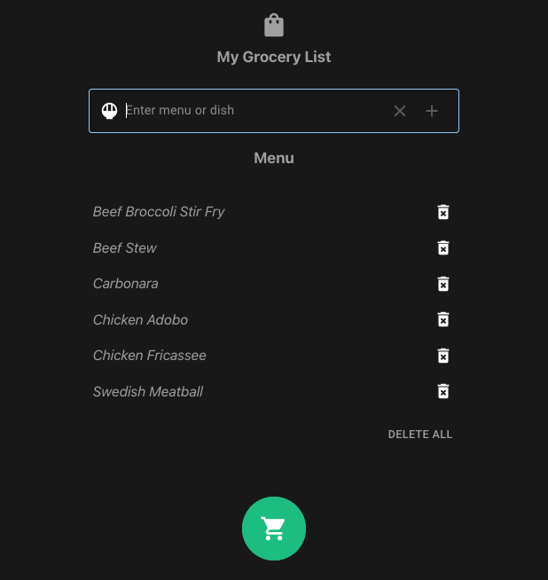
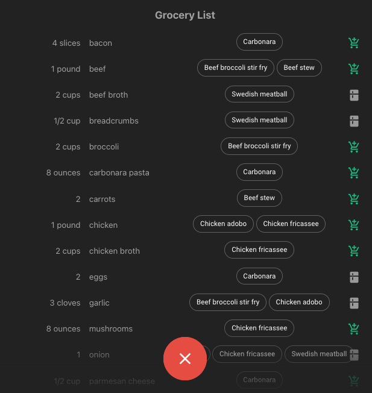

grocery-list-app
======

This is a sample React project that generates a grocery list of ingredients based on a menu or a list of dishes. It is powered by the OpenAI Chat Completion API and built using Next.js 13.

----

これは、メニューや料理のリストに基づいて食材の買い物リストを生成するサンプルのReactプロジェクトです。OpenAI Chat Completion APIを利用しており、Next.js 13を使用して構築されています。


# Application

Make a list of dishes you want to prepare and click the "Generate" button.

---

準備したい料理のリストを作成し、「生成」ボタンをクリックしてください。



The ingredients will be listed, indicating which dish they are used for. You can also specify if you already have them in your pantry.

---

食材がリストに表示され、どの料理に使用されるかが示されます。また、パントリーに既にあるかどうかを指定することもできます。



This is just a basic demo application, and there is much more that can be done to extend its functionality.

---

これは基本的なデモアプリケーションであり、その機能を拡張するためにはさらに多くのことができます。


# Extracting Ingredients from Menu

When I began this project, I wrote a prompt and utilized the `Text Completions API` to extract the ingredients. I employed the `One Shot Prompt` to guide the API in generating the results in a recognizable format and put effort into parsing it.

As soon as`OpenAI` introduced function calling, I promptly refactored the code to incorporate it, and it greatly simplified the process. The results are now provided in `JSON` format, which further streamlines the workflow.

Here's the function:

```javascript
{
    name: "get_ingredients",
    description: "List the ingredients given the list of dish.",
    parameters: {
        type: "object",
        properties: {
            ingredients: {
                type: "array",
                items: {
                    type: "object",
                    properties: {
                        name: { type: "string", description: "Name of ingredient, e.g. pork belly, ginger, garlic, fish sauce" },
                        quantity: { type: "string", description: "Quantity e.g. 1kg, 2pcs, 3cups, 4tsp, 5tbsp" },
                        dish: { type: "string", description: "Name of dish, e.g. adobo, pasta, stew" },
                    }
                }
            }
        },
        required: ["people"]
    }
}
```

And a sample result:

```javascript
{
  role: 'assistant',
  content: null,
  function_call: {
    name: 'get_ingredients',
    arguments: '{\n' +
      '  "ingredients": [\n' +
      '    {\n' +
      '      "name": "beef",\n' +
      '      "quantity": "1 pound",\n' +
      '      "dish": "beef broccoli stir fry"\n' +
      '    },\n' +
      '    {\n' +
      '      "name": "broccoli",\n' +
      '      "quantity": "2 cups",\n' +
      '      "dish": "beef broccoli stir fry"\n' +
      '    },\n' +
      '    {\n' +
      '      "name": "soy sauce",\n' +
      '      "quantity": "2 tablespoons",\n' +
      '      "dish": "beef broccoli stir fry"\n' +
      '    },\n' +
      '  ]\n' +
      '}'
    }
}
```

# Setup

Clone the repository and install the dependencies

```sh
git clone https://github.com/supershaneski/grocery-list-app.git myproject

cd myproject

npm install
```

Copy `.env.example` and rename it to `.env` then edit the `OPENAI_API_KEY` use your own API key. 

```javascript
OPENAI_API_KEY=YOUR-OPENAI-API-KEY
```

Then run the app

```sh
npm run dev
```

Open your browser to `http://localhost:3002/` to load the application page.